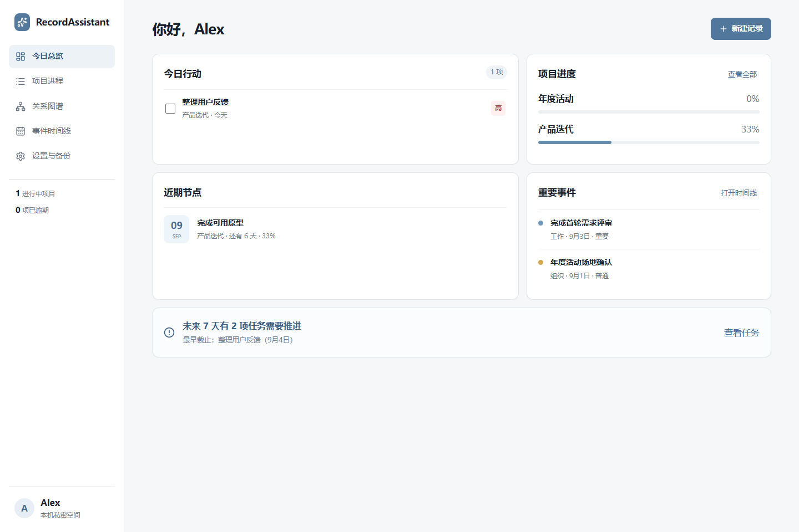

# RecordAssistant

RecordAssistant 是一个本地优先的个人记录工作台，用来把**项目进程、人物关系和重要事件**放在同一处整理。它不依赖账号或云端服务，数据保存在当前设备，并可通过 JSON 完整备份。



## 功能

- 项目、里程碑与任务管理，自动计算加权进度并提示近期节点。
- 人物档案与关系图谱，支持四维关系评分、拖动连线和清晰的分层自动排版。
- 统一事件时间线，可关联项目、人物与关系记录。
- 本地 IndexedDB 存储，支持完整 JSON 导入与导出。
- 极简浅色界面，支持 Windows 桌面端与现代浏览器。

Windows 用户可从 [Releases](https://github.com/YiheHuang/RecordAsistant/releases) 下载安装包。具体操作见[用户使用手册](docs/USER_GUIDE.zh-CN.md)。

### 本地开发

```bash
npm install
npm run dev          # 浏览器开发模式
npm test             # 运行测试
npm run app:build    # 构建 Windows 桌面应用
```

桌面端基于 Tauri 2 与系统 WebView2，前端使用 React、TypeScript、Vite、Dexie、React Flow 和 ELK。

---

## English

RecordAssistant is a local-first workspace for organizing projects, relationships, and important events. It offers weighted progress tracking, an interactive relationship graph with automatic layout, a linked event timeline, and complete JSON backup—without accounts or cloud dependencies.

Download the Windows installer from [Releases](https://github.com/YiheHuang/RecordAsistant/releases). The desktop app uses Tauri 2 and the system WebView2 runtime to remain lightweight.
